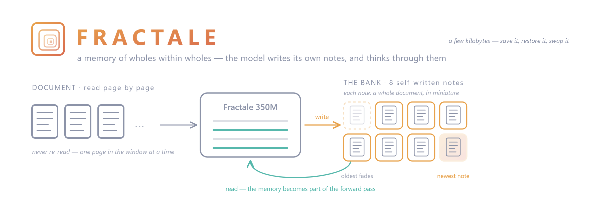

<!-- Model card for Fractale-350M-base (phase-1 final, step 19600).
     Source of truth for claims: FINDINGS.md and the paper
     (DOI 10.5281/zenodo.21225721). -->


<!-- PNG, not SVG: the HF Hub does not render SVG images in model cards.
     assets/fractale-banner.png must be uploaded to the model repo alongside
     this README (source SVG: the fractale GitHub repo, assets/). -->

# Fractale-350M-base — a 386M LM whose only long-term memory is 8 fast-weight slots

> **Fractale** (French for *fractal*): each of the 8 memory slots holds a
> self-similar miniature of a whole document — the model's memory is made of
> wholes within wholes, not of tokens.

**TL;DR.** This is a 386M-parameter **base (pretrained) model**, trained **from scratch**
around a *thought bank*: a persistent 8-slot memory that the model **writes to
itself** (one gist vector per 512-token chunk) and **reads as fast weights** —
each slot is expanded by a hypernetwork into a low-rank MLP layer that the
token stream passes through. The bank is the **only** channel that carries
information across chunks: each chunk is a separate forward pass, so anything
older than the current window must travel through those 8 vectors. The
training objective (*deferred continuation*) makes the model predict the
opening of the **next, never-seen** chunk of a document from the bank alone.

This is a **research artifact**, not an assistant. It exists to answer one
question at a scale worth reporting: *can a language model learn, forward-only
and without any backward pass at inference, to maintain and use its own
persistent working memory?* At 3M and 97M parameters the answer was yes
(paper + research log below); this checkpoint is the 386M instance.

## The thought bank, in plain words

**What it is.** Imagine reading a long book while only ever seeing one page
at a time — and being allowed **8 sticky notes**. Every time you finish a
page, you write one note *in your own shorthand*; when the notes are full,
the oldest is peeled off to make room. That is the whole memory of this
model: it never re-reads previous pages. Everything it knows about what came
before lives on those 8 notes, which it wrote to itself.

**What makes it unusual.** In a classic LLM, "memory" means stuffing the
whole history back into the prompt: the model literally *re-reads*
everything, every time, and forgets it all the moment the conversation ends.
Here the notes are not text — each one is a compressed thought-vector that
plugs back into the network as a tiny piece of **extra machinery** (fast
weights): the model doesn't *look at* its notes, it *thinks through* them.
And crucially, nobody programmed the note-taking. The model **learned** what
to write, when to overwrite, and how to use a note written twenty pages ago —
because it was trained on exactly one game: *"predict how the next, unseen
page begins, using only your notes."*

**What it's for.** The bank is a state you can hold in your hand — 8 vectors,
a few kilobytes. You can:

- **carry it** across calls: feed a long document chunk by chunk and the model
  accumulates a running gist of it, without any growing prompt or growing
  cost;
- **save and restore it**: persist a session's memory to disk today, reload
  it tomorrow — the "conversation" survives the process;
- **reset it**: drop the memory deliberately and get a clean-slate model;
- **inspect and swap it**: hand the model a bank written from *another*
  document and watch its predictions follow the memory, not the prompt — the
  probes in the research repo are built on exactly this.

**What to expect from it.** The notes hold the *gist* — what the document is,
its domain, its style, the facts it announced — not a word-for-word copy. Ask
"what was going on in that file?" and the memory helps a lot; ask it to quote
line 3 verbatim and it can't. That trade — a few kilobytes of self-written
notes instead of a re-read of the whole history — is the object of study.

- **Paper (mechanism, at 3M):** *A Trained Fast-Weight Memory: Continual Rule
  Binding at Inference Without Backward* —
  [DOI 10.5281/zenodo.21225721](https://doi.org/10.5281/zenodo.21225721)
- **Usage repo (start here):** https://github.com/fractale-lm/fractale —
  loading, generation and bank-management scripts for this model. Because the
  memory lives *outside* the context window, inference differs from a classic
  LM: you carry a bank state across calls instead of a growing prompt.
- **Research repo:** https://github.com/kkuette/thought-bank — training code,
  research log ([FINDINGS.md](https://github.com/kkuette/thought-bank/blob/main/FINDINGS.md)
  with exact reproduction commands for every claim), baselines and probes.

## Why this might interest you

Standard long-context approaches scale the attention window; test-time
training back-propagates at inference. The thought bank is a third path:
**trained memory behaviour**. Findings established at smaller scales, each
with an exact control (same model, same tokens, bank ablated or reset):

- **Forward-only rule installation.** A single 13-token presentation installs
  a never-trained rule at 0.79–1.00 accuracy on unseen queries (chance 0.008),
  replaceable mid-conversation in one forward pass. On the same conversations,
  test-time training fits its adaptation examples and transfers **nothing**,
  at 138× the cost per update (paper, 3M scale).
- **Memory policy is trained, not architectural.** The identical architecture
  trained on fixed-structure data perseverates totally on a rule switch;
  randomizing training structure installs the full keep/overwrite policy
  (paper, Table 4).
- **On real data, the bank is a working long-context memory** (97M scale,
  research log 2026-07-09 / 2026-07-16): +0.85 nats of bank advantage on
  held-out documents, flat from 1 to 10 chunks deep; content is
  **addressable** by label cues (−0.41 to −0.54 nats), survives FIFO eviction
  for 2000+ steps, transfers **across modalities** (docstring↔code, both
  directions positive), and is specific to *which* document, not how it is
  chunked.
- What the bank stores is a **gist** — domain, register, structure, the
  addressed facts — in a recency-weighted superposition; it is not a verbatim
  copy-buffer.

## Model details

| | |
|---|---|
| Parameters | 386M (from scratch) |
| Trunk | DeepSeek-style: 12 layers, d_model 768, 12 heads, MoE (4 routed + 1 shared experts, top-2), CSA/HCA attention, mHC hyper-connection residuals (Sinkhorn) |
| Thought bank | 8 slots × `mem_dim` 512, FIFO, 4 seed slots; write = one gist vector per chunk; read = per-slot hypernet → low-rank (r=8) SwiGLU fast-weight MLP applied to the token stream |
| Context window | 512-token chunks (max_seq_len 640) — deliberately short: the bank, not the window, is the long-range channel |
| Tokenizer | [HuggingFaceTB/SmolLM2-135M](https://huggingface.co/HuggingFaceTB/SmolLM2-135M) (49152 vocab) |
| Precision | Trained in AMP (bf16 autocast); checkpoints in fp32 |
| License | MIT |

The architecture is **custom PyTorch** — it does not load with
`transformers.AutoModel`. Use the code in the GitHub repo (see *How to use*).

## Training (phase 1)

**Objective.** Documents are split into 512-token chunks fed as successive
forward passes; after each chunk the model writes one vector into the bank.
On a *deferred continuation* turn the input is blank tokens and the model must
predict the opening 16 tokens of the next chunk — the bank is the only path
from the document to the prediction. Loss = next-token CE + deferred CE, with
a teacher-forced bootstrap on the write (distillation annealed to zero early
in training) to break the ignore-the-bank fixed point — without it the model
converges to never reading the bank (paper §5).

**Data.** ≈10B tokens (sampling with replacement from a ≈2.4B-token unique
pool), a 13-source mix of code and English web/reference text:

| Source | Weight |
|---|---|
| codeparrot-clean (Python) | 20% |
| the-stack (C, Rust, JS 6% each; SQL, HTML, CSS 4% each) | 30% |
| fineweb / fineweb-edu | 10% / 8% |
| Wikipedia (en) | 8% |
| finemath (4+) | 8% |
| cosmopedia (openstax 6%, khanacademy 4%) | 10% |
| scientific_papers (arXiv) | 6% |

**Data licensing & attribution.** This model is trained on publicly released
datasets, each under its own terms, which we gratefully acknowledge:
[FineWeb](https://huggingface.co/datasets/HuggingFaceFW/fineweb) and
[FineWeb-Edu](https://huggingface.co/datasets/HuggingFaceFW/fineweb-edu)
(HuggingFaceFW, **ODC-By 1.0**, subject to the CommonCrawl terms of use);
[The Stack](https://huggingface.co/datasets/bigcode/the-stack) (BigCode —
permissively-licensed source code; use subject to the BigCode terms, and the
original code remains under its individual licenses; repository authors can
check inclusion and opt out via
[Am I in The Stack](https://huggingface.co/spaces/bigcode/in-the-stack));
[codeparrot-clean](https://huggingface.co/datasets/codeparrot/codeparrot-clean)
(public GitHub Python code);
[Wikipedia](https://huggingface.co/datasets/wikimedia/wikipedia) (**CC BY-SA
4.0**); [FineMath](https://huggingface.co/datasets/HuggingFaceTB/finemath)
(**ODC-By 1.0**);
[Cosmopedia](https://huggingface.co/datasets/HuggingFaceTB/cosmopedia)
(synthetic, **Apache 2.0**); and
[scientific_papers](https://huggingface.co/datasets/armanc/scientific_papers)
(arXiv articles, per-article licenses). The MIT license on this repository
covers the **model weights and code**, not the training texts; generated
output may occasionally reproduce fragments of training data subject to
their original terms.

**Recipe.** 8× A100-80GB (DDP), batch 32/GPU, 19,600 steps ≈ 550k
tokens/step (≈10.8B tokens seen); AdamW (1.5e-4) + Muon (3.75e-4,
`√cols`-normalized with `muon_ref_mem_dim` correction); WSD schedule (step
decay from step 2000); grad clip 1.0; a NaN guard skips the update when the
all-reduced grad norm is non-finite, and the persistent bank state is
sanitized between files (a NaN written into a carried bank otherwise
contaminates every later step). Total compute: about 30 h of pod time ≈ $320,
including the incident replay below — the entire run was self-funded.

**Training incident, disclosed.** Around step 2500 the run hit a forward-pass
NaN that contaminated the carried bank; it was caught, the run resumed from
the last verified-clean checkpoint (step 2500), and the learning-rate
schedule was brought forward (decay from step 2000 instead of 60%) — the
skip-rate telemetry showed full-LR updates were pushing the weights into the
overflow region. The NaN guard and bank sanitization above were added as a
result. The guard kept firing for the rest of the run (≈16% of updates
skipped overall, escalating late in training despite LR decay — the drift is
in the weights, not the LR; root-causing it is on the phase-2 list), yet all
health metrics (bank advantage, in-context ppl, depth flatness) improved
monotonically to the end: code-side bank advantage still rose +8.74 → +9.42
nats over the final 1,100 steps.

**Checkpoint provenance.** This checkpoint is `model.pt` = step 19,600 (the
final step; fp32, self-describing `{"cfg", "model"}`) of a single training
run of `v350_phase1_10b.yaml`, trained with
`deepseek_v4_mini.code_defer_native` at thought-bank commit
[`073bb67`](https://github.com/kkuette/thought-bank/commit/073bb67) (branch
`claude/status-check-2fa903` — config and stability patches exactly as run).
The [usage repo](https://github.com/fractale-lm/fractale) vendors its
inference code from that same commit, and ships a **step-by-step
reproduction of this run** (environment, data prebuild, launch command,
what to expect):
[`repro/phase1/`](https://github.com/fractale-lm/fractale/tree/main/repro/phase1).

**Curriculum provenance.** Phase 1 is the *batched* recipe (fixed chunks, no
addressing flags), the scaled twin of the 97M `v350_curr_p1` cell validated in
the research log (2026-07-16). This checkpoint is the **end of pretraining**;
everything downstream is phase 2 (see below).

## Phase 2 (exploratory) — from memory to behaviour

This base model *has* a working memory; phase 2 explores teaching it to *use*
one deliberately. Announced as **exploratory** — directions, not promises:

- **Continued pretraining** with variable chunking and the reach-back
  curriculum (addressing under adversarial recency), validated at 97M.
- **Instruction tuning** (ChatML) where remembering, refreshing and reaching
  back into the bank are instruction-following behaviours across turns.
- **RL on verifiable tasks** (math → code) with the bank as the model's
  working memory, evaluating the bank-ON/OFF delta at matched cost on
  abstraction-reasoning benchmarks.

Phase-2 checkpoints, if they hold up, will be released in this same
collection.

## Evaluation

The headline metric is **GAP = CE(reset bank) − CE(carried bank)** on the
deferred-continuation turn of held-out documents: how many nats the bank's
content shifts the prediction toward the true continuation of a document the
model has never seen. It is an exact content control — same weights, same
target, the only difference is whether the written gists are present.

Final checkpoint (step 19,600), held-out documents, 3090 eval harness
(re-run noise ±0.3 nats):

| Metric (held-out) | Value |
|---|---|
| GAP, code (codeparrot) | **+9.42 nats** (CE 12.86 reset → 3.45 carried) |
| GAP, web (fineweb) | **+7.27 nats** |
| GAP at position 0 (bank only, first deferred token block) | +9.45 nats (code) |
| GAP by depth (2→8 chunks written) | flat, d2 ≈ d8, both sources — no FIFO cliff |
| In-context ppl, code / web | 8.4 / 94 |

The trajectory over training is the point, not just the endpoint: from step
500 to 19,600 the code GAP rose +1.04 → +9.42 nats (web +2.05 → +7.27) and
in-context ppl fell monotonically (code 237 → 8.4). The gap widened from
*both* sides — the bank-only arm kept sharpening while the no-bank arm
degraded — i.e. the model grew **more dependent on its memory** as training
progressed, which is exactly the behaviour the objective selects for.

Two caveats we state up front rather than in fine print:

- The GAP compares the model **to itself without its memory**, not to an
  external baseline at matched compute; baseline comparisons live in the
  [research repo](https://github.com/kkuette/thought-bank).
- Closed-book token accuracy on the deferred turn is low (0.06–0.19).
  Remember what this checkpoint is: a **pretrained base model**, not a
  fine-tuned one. The bank reliably carries *gist* — domain, register,
  structure, addressed facts (a +6 to +8 nat distribution shift) — not
  verbatim continuations. Judge it as a memory, not as an oracle; teaching
  the model to *act* on that memory is exactly what the phase-2 fine-tuning
  is for.

## How to use

Inference with this model is **not** the classic tokenize-and-generate loop:
the model reads documents chunk by chunk and carries a bank state between
forward passes. The [usage repo](https://github.com/fractale-lm/fractale) owns
that loop through one object, `BankSession`:

```python
# git clone https://github.com/fractale-lm/fractale && cd fractale && pip install -e .
from fractale import BankSession

sess = BankSession.from_pretrained("fractale-lm/Fractale-350M-base")

# Read anything, any length — the bank accumulates, no growing prompt.
sess.read(open("mystery_novel_ch1-9.txt").read())

# What does the model expect next — from its 8 notes ALONE (blank input)?
print(sess.continuation(32))
print(sess.continuation(32, use_bank=False))  # amnesic control: the difference IS the memory

# The memory is a state you hold in your hand (a few kB).
sess.save_bank("novel.bank")       # persist today...
sess.reset()                       # ...clean slate...
sess.load_bank("novel.bank")       # ...restore tomorrow

print(sess.bank_stats())           # slot norms + similarities
```

Two runnable demos ship with the repo: `scripts/read_document.py` (feed a
file, compare with-memory vs amnesic vs the true continuation) and
`scripts/swap_banks.py` (the memory transplant: same blank prompt, two
banks — predictions follow the bank, not the prompt).

Under the hood the model is custom PyTorch (`ThoughtBankLM`, also exported
by the package): the bank travels through `init_mem` / `out["mem_bank"]` on
each forward. Keep passing it and the model accumulates a working memory of
everything it has read, 8 vectors at a time; drop it and the model is
amnesic beyond its 512-token window — that difference *is* the object of
study. Checkpoints are self-describing (`{"cfg": ..., "model": ...}`), so
the `.pt` file is all `BankSession.load(path)` needs.

## Intended use & limitations

**Intended:** research on memory-augmented LMs — probing what a trained
fast-weight memory stores, how it addresses, evicts, and composes; a base for
the phase-2 curriculum (SFT/RL with the bank as working memory); a
counterpart for linear-attention and TTT baselines.

**Not intended:** production use of any kind. This is a **base pretrained
model** — not instruction-tuned, no safety alignment — and at 386M params
its raw generation quality is far below same-size modern baselines trained on
trillions of tokens — by design, the token budget went to the memory
mechanism, not to fluency. It inherits the biases and inaccuracies of its
web-scale sources (fineweb, the-stack, Wikipedia). English + code only.

## Provenance & transparency

This project is a two-agent collaboration, stated openly: research direction,
architectural vision and experimental judgment by **kkuette** (independent,
self-funded, single-RTX-3090 lab for everything below 97M); implementation,
experiment execution and write-ups produced in collaboration with **Claude**
(Anthropic). Every quantitative claim traces to a config + command in the
public repo.

## Citation

```bibtex
@misc{kkuette2026thoughtbank,
  title   = {A Trained Fast-Weight Memory: Continual Rule Binding at
             Inference Without Backward},
  author  = {kkuette},
  year    = {2026},
  doi     = {10.5281/zenodo.21225721},
  url     = {https://github.com/kkuette/thought-bank}
}
```

