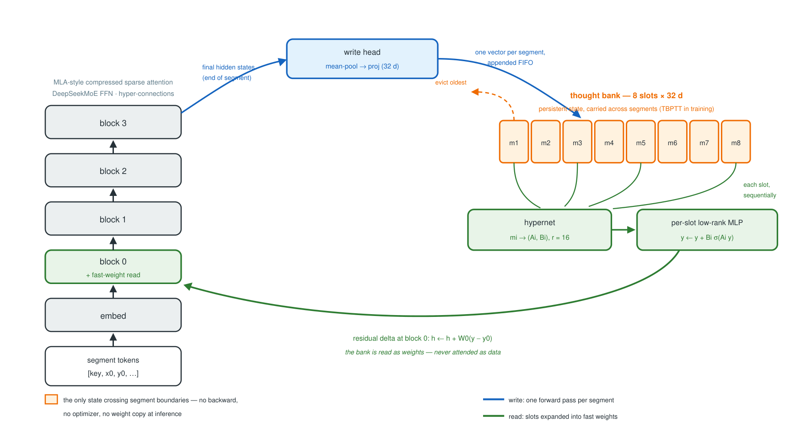
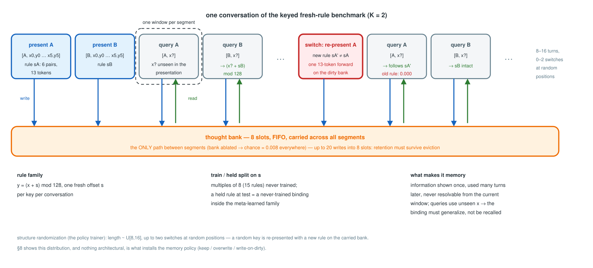
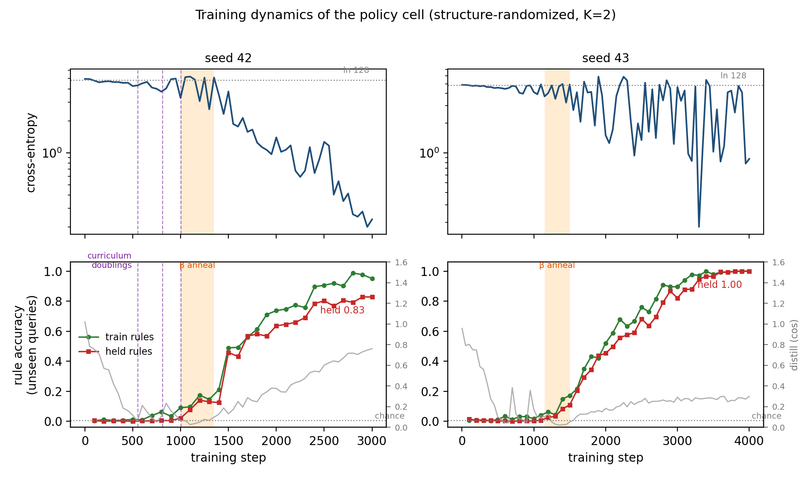
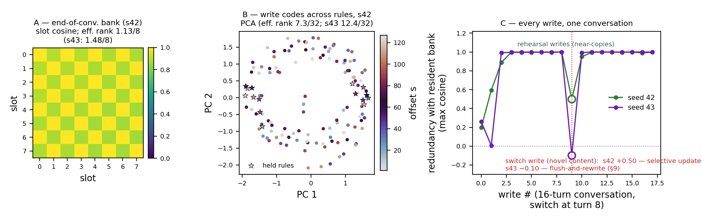
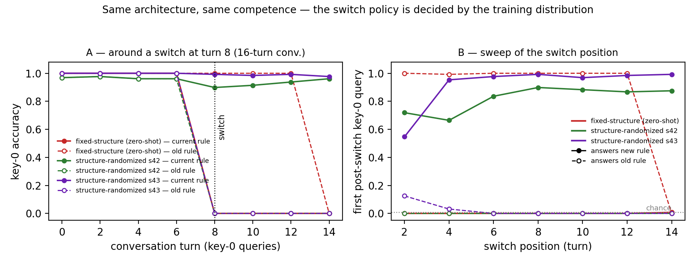

# A Trained Fast-Weight Memory: Continual Rule Binding at Inference Without Backward

*Draft v0.2 — 2026-07-06. Markdown master (figures, appendices and
references in); LaTeX port after prose freeze.*

## Abstract

Continual learning at inference usually means test-time training (TTT):
gradient steps on a clone of the model. We study the alternative the
fast-weight literature has long promised: a small bank of vectors, written by
the forward pass itself, that modulates subsequent computation — no backward,
no optimizer, no weight copy. On a keyed multi-turn rule task (a fresh modular
rule per conversation, unseen queries, K=2 concurrent rules), a 3M-parameter
transformer with an 8-slot bank learns to (i) install a never-trained rule
from a single 13-token presentation (held-rule accuracy 0.79–1.00 across two
seeds; chance 0.008), (ii) retain it across turns and slot eviction, and
(iii) replace it mid-conversation in one forward pass (post-switch accuracy
0.95 train / 0.78 held; old-rule persistence 0.000). Head-to-head on the same
conversations, TTT with a full learning-rate sweep memorizes its adaptation
examples (pair accuracy 0.99) yet transfers exactly nothing to unseen
queries, while costing 138× more per rule update and destroying 62% of the
untouched concurrent rule; in-window ICL is also at chance — the bank is the
model's only functional adaptation pathway. Crucially, none of this is
emergent from the architecture: the same architecture trained without
mid-conversation rule switches perseverates completely (old-rule persistence
1.000 zero-shot). Memory *policy* — what to keep, when to overwrite, how to
write on a dirty bank — is a trained behaviour, installed by randomizing
conversation structure at training time. We map the boundary (an untrained
rule family defeats bank and TTT equally: the limit is the meta-learned
envelope, not the mechanism) and report a seed-level bifurcation between
selective-update and flush-and-rewrite replacement policies. Training the
read/write circuit requires breaking an ignore-the-bank fixed point; we give
the recipe (teacher-forced code bootstrap with annealed blending,
mastery-gated rule curriculum) and the diversity threshold below which the
read memorizes instead of generalizing.

## 1. Introduction

A model deployed in a conversation, a coding session, or a stream of events
must absorb new bindings — this user's constraint, this variable's meaning,
this rule as of now — and use them many steps later. Current practice offers
two routes. Keep the information as *data*: in the context window, a
KV-cache, or a retrieval store, and pay attention over it forever. Or push
it into *weights* by test-time training (TTT): clone the model, take
gradient steps on the new examples, and pay a backward pass, an optimizer,
and the well-known price of sequential gradient updates — catastrophic
interference. The fast-weight literature has long promised a third route:
a small memory, written by the forward pass itself, that modulates the
computation as *weights* — no backward, no clone, no growing window. What
has been missing is a controlled demonstration that such a memory can be
*trained to work*: to bind genuinely novel content at inference,
generalize it to unseen inputs, retain it under capacity pressure, and
overwrite it on demand.

This paper provides that demonstration at small scale, with the controls
that scale would blur. A 3M-parameter transformer carries an 8-slot bank
of 32-dimensional vectors; a write head appends one vector per segment,
and a hypernetwork expands each slot into a low-rank MLP layer applied to
the token stream — the bank is read as fast weights, never attended as
data. On a keyed rule task where the binding crosses turns *only* through
the bank, the trained model installs a never-trained rule from a single
13-token presentation (0.79–1.00 on unseen queries across two seeds;
chance 0.008), retains it beyond the physical eviction of its slot, and
replaces it mid-conversation in one forward pass, evacuating the old rule
completely.

The controlled comparison is the first contribution. On the same
conversations and the same checkpoint, test-time training with a full
learning-rate sweep converges on its adaptation examples (pair accuracy
0.99) and transfers *exactly nothing* to unseen queries of the same rule;
in-window ICL is at chance even on trained rules. The bank is not merely
cheaper than the alternatives — 138× cheaper per rule update, with −14%
collateral on a concurrent rule where sequential TTT costs −62% — it is
the model's *only* functional adaptation pathway (§7).

The second contribution is, we believe, the more general one: **memory
policy is a trained behaviour, not an architectural property.** The same
architecture, trained to the same held-rule competence but on conversations
of fixed structure, perseverates totally when a rule changes zero-shot
(old-rule persistence 1.000): its write head cannot even produce a
readable code on a non-empty bank. Randomizing conversation *structure*
during training — lengths, switch positions, switch counts — installs the
full policy: persistence 0.000 at every switch position, clean dirty-bank
writes, no retention cliff (§8). The architecture supplies a substrate;
the training distribution decides what the memory *does*, the way
augmentation decides a vision model's invariances. Anyone equipping a
model with a memory mechanism should expect the same: an inference-time
behaviour the training distribution never exercised should be presumed
absent until probed.

Third, we show the training problem is itself non-trivial and give a
working recipe. Joint training of write, storage and read collapses into
an ignore-the-bank fixed point; breaking it requires a teacher-forced code
bootstrap (annealed blending plus distillation — each alone fails), a
mastery-gated curriculum, and above all rule *diversity*: below a
threshold the read memorizes its repertoire and scores exactly zero on
held rules (§5).

We state the boundary as precisely as the claim. Held rules are fresh
*parameter bindings* within a meta-learned family, not new laws: on a
never-trained family (subtraction on the same circle), the bank, TTT, and
ICL all fall to chance — the frontier is the meta-training envelope, not
the adaptation mechanism (§7). And honesty about replication: across two
seeds every headline number replicates except the *selectivity* of
replacement, which bifurcates between a selective-update and a
flush-and-rewrite attractor (§9); we report both.

## 2. Related work

**Fast weights.** The idea that one network's activity should program
another's weights goes back to Schmidhuber (1992) and was revived for
attention-era models by Ba et al. (2016). Schlag et al. (2021) showed
linear attention *is* a fast-weight programmer, and the modern recurrent
line — DeltaNet-style delta rules (Yang et al., 2024), Titans and
successors (Behrouz et al., 2025) — trains token-granular write rules
inside the sequence mixer, at scale, for language modelling perplexity. Our bank differs in granularity and in
question: one write per *segment*, read as a low-rank MLP over a
persistent multi-slot state, and evaluated not by perplexity but by an
isolable behavioural claim — can a fresh binding be installed, retained,
and replaced at inference, with the bank as the only route? The
memory-as-weights reading (slot → generated layer) also separates us from
memory-augmented models that attend to stored vectors as data.

**Memory-augmented networks.** The NTM (Graves et al., 2014) and DNC
(Graves et al., 2016) trained differentiable read/write policies
end-to-end and are the closest ancestors of our trained-policy claim;
modern Hopfield layers (Ramsauer et al., 2021) store patterns for
associative retrieval. Our contribution to this line is the *dissociation*:
identical architecture, competence matched, and the policy (retention
horizon, overwrite discipline, dirty-bank writes) swings from absent to
complete with the training distribution of conversation structure alone —
plus the zero-shot diagnosis of what an untrained policy looks like
(total perseveration, unreadable dirty-bank writes).

**Test-time training and adaptation.** TTT as an architectural principle
(Sun et al., 2024) compiles the gradient update *into* the layer; TTT as
a practice fine-tunes a clone on test-instance data (Sun et al., 2020),
recently with striking results on ARC (Akyürek et al., 2024). Our TTT arm is the practice form, taken seriously as the
natural baseline for inference-time binding, with a convergence
diagnostic that separates optimization failure from basin failure: it
fits its adaptation set perfectly and transfers nothing, and under
sequential updates it exhibits classic catastrophic interference
(McCloskey & Cohen, 1989) — which our forward-only write structurally
avoids, degrading instead by eviction, a capacity knob.

**Base architecture.** The trunk miniaturizes the DeepSeek line of
efficient transformers — latent-compressed attention (MLA; DeepSeek-AI,
2024a) and native sparse attention (Yuan et al., 2025), fine-grained
mixture-of-experts with shared experts (DeepSeekMoE; Dai et al., 2024),
as consolidated in DeepSeek-V3 (DeepSeek-AI, 2024b) and its V4 successor —
plus hyper-connection residual streams (Zhu et al., 2024). These choices are load-bearing for realism (the bank is
grafted onto a production-style stack, not a bespoke toy), not for the
claims.

**Meta-learning and its envelope.** Our setting is meta-learning in the
MAML/in-context sense (Finn et al., 2017): training installs a family;
inference binds its parameters. The out-of-family boundary we measure
(subtraction defeats every arm) is the small-model, controlled version of
the counterfactual-task literature on LLMs (Wu et al., 2024), where
out-of-distribution variants of trained competences degrade sharply but
remain above chance because a web-scale envelope contains composition
primitives our 3M-parameter envelope lacks. The diversity threshold of §5
likewise mirrors the known transition from memorization to in-context
generalization as task diversity grows (Chan et al., 2022; Raventós et
al., 2023), and our bootstrap plateaus have the grokking phenomenology
(Power et al., 2022) — we treat these classical twins as diagnostic tools
throughout.

## 3. Architecture: the Thought Bank

The model is a 4-block decoder-only transformer (d_model 128, 3.08M
parameters) augmented with a *thought bank*: a FIFO buffer of M=8 slots of
dimension 32, carried across segments of a conversation as persistent
state (Fig. 1).

*Figure 1 — The Thought Bank. A pooling write head appends one 32-d
vector per segment to an 8-slot FIFO bank; a hypernetwork expands each
slot into a low-rank MLP applied sequentially to the residual stream at
block 0. The bank is the only state crossing segment boundaries — no
backward pass, no optimizer, no weight copy at inference.*

**Trunk.** The trunk is a miniature of the DeepSeek-V4 stack: compressed
sparse attention (a two-tier local/compressed scheme in the spirit of
DeepSeek's sparse attention, with latent-compressed queries), a
fine-grained DeepSeekMoE feed-forward with a shared expert, and
hyper-connection residual streams. We adopt this stack because it is
representative of current production architectures — the point of the
paper is what a *memory* adds to such a trunk, not the trunk itself —
and none of our claims depend on it: the bank interfaces with the trunk
only through a pooling write head and a residual read delta, both
trunk-agnostic. Three components interact with the bank.

**Write.** At the end of each segment, a write head mean-pools the final
hidden states and projects them to a single 32-dimensional vector, which is
appended to the bank; when the bank exceeds M slots the oldest is evicted.
One segment, one write — the write head has no per-token addressing and no
learned gate in the main recipe (App. C audits the gate: it accelerates the
bootstrap by ~30% but slows post-bootstrap consolidation 4–6×; all headline
results use gate OFF).

**Read (fast weights).** The bank is read as *weights*, not as data. Each
slot vector m_i is expanded by a learned hypernetwork into a low-rank MLP
layer (A_i ∈ R^{r×d}, B_i ∈ R^{d×r}, r=16, SwiGLU gating), and the token
stream is passed through the slots sequentially:

  y ← y + B_i · σ(A_i y),  i = 1…M;  h ← h + W_o (y − y_0).

The read is a residual delta, so an empty or irrelevant bank is a near
no-op. The non-linearity is essential: summing rank-r linear maps collapses
to a single linear map, and a rank-1 outer-product read (the classical
fast-weight form) cannot express the input-dependent *mapping* our task
requires — an ablation line, not a hypothetical: the outer-product read was
our first design and never exceeded chance on rule application. The read is
applied at block 0 only; grafting reads onto all four blocks helps a larger
variant of the task (App. D) but is not needed here.

**Credit assignment.** Gradients flow into the write head only through the
read of *later* segments, so training back-propagates through the bank
across segment boundaries (truncated BPTT; the window must cover the
conversation — with a window of 1 the write head receives no gradient at
all and the bank never trains).

**Cost model.** Installing or updating one rule = one forward pass over a
13-token segment. With the 2·P·tokens FLOPs proxy (P=3.08M) that is 80
MFLOPs; we use the same proxy (×3 for forward+backward) for the TTT arm.

## 4. Benchmark: keyed fresh-rule conversations

We want the smallest task where *inference-time* memory is both necessary
and measurable: information presented once, used many turns later, never
resolvable from the current window.

**Task (Fig. 2).** A conversation binds K=2 key tokens to rules drawn
from the family y = (x + s) mod 128, one fresh offset s per key per
conversation.
It opens with one *presentation segment* per key — [key_k, x_0, y_0, …,
x_5, y_5], 13 tokens, six example pairs — followed by 8–16 *query turns*
[key_k, x_q] with x_q drawn from the symbols *not* shown in the
presentation. Each segment is processed in its own window: the only path
from a presentation to a query is through the bank. Bank ablation is
therefore an exact control, and sits at chance (1/128 ≈ 0.008) in every
experiment below.

**Fresh bindings, not fresh laws.** The train/held split is on the offset
s: multiples of 8 (15 rules) are *held out* — never seen in training —
and the remaining 112 form the training pool. A held rule at test time is
a genuinely never-trained (key → s) binding, but it lives inside the
family the model was meta-trained on. Throughout the paper we accordingly
claim *fresh parameter binding within a meta-learned family*, not the
learning of new laws; §7 measures what happens outside the family, and
the answer is the boundary of the claim.

**Structure randomization (the policy trainer).** In the policy-training
configuration, conversation *structure* is itself randomized: length is
drawn uniformly from 8–16 turns, and up to two *switches* occur at random
positions — a random key is re-presented with a new rule, on the carried
(dirty) bank, and subsequent queries for that key follow the new rule.
A conversation can thus produce up to 20 writes into 8 slots, so retention
must survive eviction. The optimizer steps once per conversation. §8 shows
that this distribution, and nothing architectural, is what installs the
memory policy.

*Figure 2 — One conversation of the keyed fresh-rule benchmark. Each
segment is processed in its own window; presentations and queries all
write to the carried bank, queries read from it. A switch re-presents a
key with a new rule on the dirty bank. Bank ablation is an exact control
and sits at chance (0.008) in every experiment.*

## 5. Training the memory: breaking the ignore-bank fixed point

Joint training of write, storage and read fails from scratch: the read
initially extracts nothing, so the loss gradient prefers routing around the
bank; the write head then receives no useful signal, and the system settles
into an *ignore-the-bank* fixed point (CE at the ln 128 floor for the
unresolvable queries, bank ablation gap ≈ 0). Figure 3 shows the full
training dynamics of the recipe that breaks it (both seeds; App. A walks
through the curves).

*Figure 3 — Training dynamics of the policy cell, seeds 42 and 43. Top:
cross-entropy (log scale) with curriculum doublings (purple, seed 42) and
the β-anneal window (orange). Bottom: rule accuracy on unseen queries
(train vs held) with the write-distillation loss (grey, right axis). All
behavioural competence is acquired after β=0; the post-anneal rise of the
distillation loss is the code drift of App. B. Seed 43's higher final CE
is the visible cost of its flush-and-rewrite attractor (§9).* The failure is not in the
read itself: given any *fixed* consistent code for s injected into the
bank — one-hot, random frozen, learned embedding — the read learns to apply
it almost perfectly in isolation. The wall is credit assignment through the
write→store→read loop. Three ingredients break it:

1. **Teacher-forced code bootstrap.** During early training the bank
   content for a presentation is blended toward a fixed *Fourier code* of
   the rule (harmonics k ≤ 8 of s on the circle Z_128):
   slot ← β·teacher + (1−β)·write, with β annealed 1 → 0 over 300 steps
   once the curriculum (below) reaches 64 rules. A cosine distillation loss
   pulls the write head toward the teacher during the blend. The teacher is
   a *kick*, not a target the model keeps: after the anneal the write drifts
   off the Fourier circle into its own anisotropic code map (App. B), and
   distillation never fully converges — by design it only has to hold the
   loop together until the read has something consistent to learn from.

2. **Mastery-gated curriculum.** The rule pool starts at 16 offsets and
   doubles (16→32→64→112) each time a CE-mastery criterion is met, with a
   minimum dwell. Fixed-schedule versions of the same curriculum fail:
   either the early pool is too small for too long (the read memorizes) or
   the anneal fires before the loop is closed (the code collapses).

3. **Blend + distillation jointly.** β-blending without the distillation
   loss is at chance; distillation without blending never closes the loop.
   Neither half-measure works — the pair is the active ingredient.

**Diversity threshold.** With ≤25 training rules the read *memorizes*: train
accuracy reaches 0.99 while held rules score exactly 0.000 — the read snaps
any held code to its nearest trained neighbour, and sharpening on the
repertoire is orthogonal to interpolation on the manifold. At 112 rules,
held tracks train throughout. The transition sits somewhere in (25, 112];
we did not bracket it further. Diversity of *rules* is what converts the
read from a lookup into a function.

**What survives randomized structure.** The full recipe transfers to the
structure-randomized distribution of §4 at a cost: curriculum milestones
arrive ~2× later (pool doublings at steps 553/814/1004 vs 259/437/592 on
fixed structure), the anneal completes (distill 0.027), and held ≥ train
mid-run. Pushing randomization further — K drawn from 2–5 *and* 8–32 turns
*and* unconstrained switches — never bootstraps at this model size: CE
stays at floor and the distillation loss *rises*, the signature of the
fixed point re-forming. The structural-entropy wall is real; we bracketed
it rather than crossed it.

## 6. Results I: a functional, generalizing memory

All numbers in this section are computed on conversations with *unseen
query symbols*; "held" additionally means the rule offset s was never seen
in training. Chance is 0.008. The policy-trained cell was run twice
(seeds 42 and 43, identical config and data stream).

| capability | seed 42 (@3000) | seed 43 (@4000) |
|---|---|---|
| train rules, unseen queries | 0.951–0.987 | ~1.000 |
| **held rules (never trained)** | **0.792–0.828** | **0.997–1.000** |
| replacement: post-switch accuracy (train / held target) | 0.953 / 0.777 | 0.91–1.00 |
| old-rule persistence after switch (STICK), positions 2–14 | 0.000 | 0.000–0.051 |
| dirty-bank write identifiability (1-NN vs clean-code dictionary) | 0.90 | 0.95 |
| bank ablated | 0.008 (chance) | chance |

**Binding.** A single 13-token presentation of a never-trained rule yields
0.79–1.00 accuracy on unseen queries across the two seeds. The band is the
central claim: the bank is not a cache of trained associations but a
*generalizing* memory — the write places a fresh binding somewhere the read
can use, for offsets the read has never been supervised on.

**Retention.** There is no cliff at the bank's capacity. In a 16-turn
conversation with a switch at turn 8, the first rule's code is physically
evicted from all 8 slots (1-NN identification drops to ~0), yet post-switch
accuracy is 0.924. Retention outlives the slot that carried it.

**Mechanism: redundant superposition (Fig. 4).** Probes on both trained
seeds show the 8 slots converge to nearly the same vector: the *bank's*
effective rank at the end of a conversation is 1.13 / 1.48 out of 8
(seeds 42 / 43), with every slot-pair cosine above 0.9 (the residual
structure is a parity checkerboard — the two keys' rehearsal streams
alternate). This is not representational collapse — the ablation gap is
+4.6 nats, and across rules the clean write codes span an effective rank
of 7.3 / 12.4 of 32 dimensions once the shared mean direction is removed
(near-zero mean inter-rule cosine after centring; 1-NN identifiability
0.90–0.95). The bank stores the conversation's bindings as one superposed
vector, *copied* into every slot; the key-conditioned read disambiguates
at application time. The redundancy is what buys eviction robustness:
evicting any slot removes a copy, not the content. Two practical
corollaries: (a) low bank rank alone is not a pathology signal — it must
be read jointly with the ablation gap; (b) a switch write is genuinely
novel content — its redundancy with the resident bank drops to +0.50
(seed 42) or −0.10 (seed 43), vs ~1.0 for steady-state rehearsal writes —
and the bank re-converges to the new superposition within one turn
(redundancy back to ≥0.95 at the next write). The seed gap in that dip is
not noise; it is the §9 bifurcation, visible at the write itself.

*Figure 4 — The superposition mechanism. (A) End-of-conversation
slot-slot cosines: all 8 slots ≥ 0.9, effective rank ~1; the parity
checkerboard is the two keys' alternating rehearsal streams. (B) PCA of
clean write codes over all 127 rules: the code space stays
high-dimensional and rule-separable (held rules ★ on-manifold). (C)
Redundancy of every write with the resident bank across a switch
conversation: rehearsal writes are near-copies, the switch write is novel
content — and its depth separates the two §9 attractors.*

**Replacement.** Mid-conversation, re-presenting a key with a new rule —
one 13-token forward on the dirty bank — installs the new binding at
0.953 (train) / 0.777 (held) and evacuates the old one: the model answers
the *old* rule on 0.0% of post-switch queries (STICK, swept over switch
positions 2–14). The dirty-bank write is clean: its 1-NN identification
against a dictionary of fresh-bank codes is 0.90–0.95, indistinguishable
from writes on an empty bank.

## 7. Results II: head-to-head against test-time training

The natural objection to §6 is that gradient-based adaptation would do the
same, better. We test it on the *same 64 conversations, same checkpoint*,
four arms (Table 3):

- **bank** (ours): presentations written to the bank, forward only.
- **TTT**: bank ablated; a per-conversation clone of the full model takes
  AdamW steps on the conversation's 12 example pairs formatted exactly as
  queries ([key, x] → y); learning rate swept over {3e-4, 1e-3, 3e-3},
  evaluated at 1–50 steps; best cell reported.
- **ICL**: the example pairs placed *in the query window* — the standard
  in-context route.
- **ablate**: no presentation at all (chance floor).

| pool | bank | TTT (best over LR × steps) | ICL in-window | ablate |
|---|---|---|---|---|
| train | **0.992** | 0.008 | 0.006 | 0.006 |
| held | **0.799** | 0.002 | 0.010 | 0.010 |
| subtraction (fresh family) | 0.012 | 0.004 | 0.002 | 0.008 |

**The TTT arm is healthy — that is the point.** Its pair loss falls from
5.12 to 0.03 and it reaches 0.99 accuracy *on its own adaptation
examples*: the optimization converges, and more steps change nothing.
It memorizes the 12 pairs and transfers exactly nothing to unseen queries
of the same rule. Fifty gradient steps land in a lookup-table basin; the
one-forward write lands in the generalizing one. The failure is the basin,
not the budget.

**The bank is the only functional pathway.** ICL is at chance *even on
trained rules* — surprising, since the presentation-turn format is
supervised during training — meaning this model simply has no in-window
adaptation route; and gradient adaptation, as above, fits without
transferring. Whatever competence the trunk has for the rule family is
reachable only through the bank code.

**The boundary, measured in the same protocol.** The third row is the
fairness arm: rules become y = (x − s) mod 128 — the same circle, the same
geometry, the reversed direction, never trained. Here TTT is *allowed* to
leave the meta-learned family (it updates weights); the bank is not
(forward only). Both are at chance. The boundary of inference-time
adaptation in this regime is the meta-training envelope, not the
forward-vs-gradient distinction. (A gate-ON control checkpoint, whose
write codes live off the Fourier circle entirely, is also at chance on
subtraction: no code geometry we trained buys family transfer.)

**Replacement under a concurrent load (Table 4).** Act two takes the TTT
protocol seriously as a *continual* learner. Both arms first install both
keys' rules (bank: two forwards; TTT: 50 steps to pair-fit 1.000). Then
key 0's rule is replaced while key 1 must keep serving. Since TTT's query
accuracy is chance regardless, we grant it the most favourable metric
available: retention of its own pair-fit on the untouched key.

| | bank | sequential TTT (50-step update) |
|---|---|---|
| update cost | **80 MFLOPs** (one 13-token forward) | 11,075 MFLOPs = **138×** |
| new rule, unseen queries | **0.953 train / 0.777 held** | chance (pair-fit 0.97) |
| untouched key | 0.977 → 0.832–0.844 | pair-fit 1.000 → 0.383–0.344 (**−62%**) |
| old rule | evacuated (STICK 0.000) | 0.979 → 0.078 |

The two collateral losses are qualitatively different. The bank's −0.14 on
the untouched key is *eviction pressure* — the switch adds writes to an
8-slot buffer — a capacity knob, adjustable by M. TTT's −62% is
catastrophic interference, intrinsic to sequential gradient updates on
shared weights. One mechanism degrades by forgetting copies; the other by
overwriting the function.

## 8. Results III: memory policy is a trained behaviour

Everything in §6 could be read as a property of the architecture. It is
not. We ran the identical switch probe, zero-shot, on a checkpoint of the
*same architecture* trained to the same held-rule competence (0.85) but on
*fixed* structure — 8 turns, no mid-conversation switches (Fig. 5):

*Figure 5 — Memory policy is a trained behaviour. (A) Key-0 accuracy
around a switch at turn 8: the fixed-structure model keeps answering the
old rule on every post-switch query (red dashed at 1.0 — until its
trained 8-turn horizon evicts the code at the last turn); both
policy-trained seeds install the new rule in one forward pass. (B) The
same, swept over switch positions 2–14, measured on the first post-switch
query.*

| | fixed-structure training (zero-shot switch) | structure-randomized training |
|---|---|---|
| STICK (old-rule persistence) | **1.000** | **0.000** (positions 2–14) |
| post-switch new-rule accuracy | 0.000 | 0.74–0.95 |
| dirty-bank write identifiability (1-NN) | 0.05–0.10 | 0.90 |
| old code physically evacuated | no | yes |
| K=2 key routing across the switch | intact (~1.00) | intact |

The zero-shot model *perseverates totally*: presented with a new rule
mid-conversation, it keeps applying the old one to every subsequent query.
The mechanism is visible at the write: on a dirty bank its write head
deposits a code that matches nothing in the clean-code dictionary (1-NN
0.05) — writing on a non-empty bank is simply out of its training
distribution. Only key routing survives zero-shot. Retention shows the
same signature: models trained on a fixed 8-turn horizon exhibit an exact
FIFO cliff at the training horizon, while the structure-randomized model
shows none (§6).

The delta between the two columns is *only* the training distribution of
conversation structure — same architecture, same bank, same rule family,
same recipe. What the memory *does* — keep, overwrite, write-on-dirty,
survive eviction — is decided by the distribution, the way visual
invariances are decided by augmentation. The architecture is a substrate;
the policy is data. We are careful not to overstate this: key routing did
survive the zero-shot probe, and the trained policy generalizes within
its envelope (switch positions are interchangeable across the trained
range; held rules install mid-conversation). But every policy that was
absent from the training distribution was absent from the behaviour —
down to the write head being unable to produce a readable code on a bank
state it had never written on. We believe this is the observation most
likely to transfer beyond our toy: a memory mechanism does not come with
its policy included, and each inference-time behaviour one wants
(retention horizons, overwrite discipline — or usages we did not test,
such as interleaved ingestion and later recall of multiple contexts)
should be presumed to need matching pressure in the training
distribution until probed.

## 9. Findings and boundaries

**A seed-level bifurcation in replacement policy.** The two seeds of the
policy cell replicate every §6 number except one. When key 0 is switched,
seed 42 *preserves* key 1 (categorized accuracy on the true training
stream: 0.863 on the non-switched key post-switch) while seed 43 flushes
the whole bank and rewrites only the switched binding (0.011 — chance) —
despite being the stronger model on every other axis (held 0.997–1.000).
The non-switched key accounts for 17% of query tokens, so seed 43 pays
chance-level loss on those queries for the entire run — its training CE
converges to a visibly higher band than seed 42's (≈2.6 vs ≈0.4 over the
last 500 steps; App. A) — and the gradient still never crosses into the
selective basin. The attractor is
visible at the write itself: the switch write's redundancy with the
resident bank is +0.50 for seed 42 (it preserves the resident
superposition) but −0.10 for seed 43 (it displaces it; Fig. 4C). Two
attractors of the
update policy — *selective component update* vs *flush-and-rewrite* — are
decided during the bootstrap and gradient does not cross between them.
Selective replacement plausibly requires a copy-forward circuit (the write
re-reads the bank and re-emits the untouched component); average loss
pressure evidently does not force it. We report both attractors rather
than selecting the flattering seed; steering the basin (event ordering
during bootstrap, or introducing switches only after retention
consolidates) is future work.

**Out-of-family is out of reach for every arm** (§7, subtraction row) —
and this is consistent with sequential and mixed two-family training
attempts at this scale, all negative, and with the counterfactual-task
literature on large models, where out-of-family performance degrades
sharply but stays above chance precisely because a large pretraining
envelope contains the composition primitives our 3M-parameter envelope
lacks.

**Composition is a policy gap, not a capacity gap.** The trunk can chain:
feeding f(x)'s output back as a new query (external chaining) scores
0.961. Asked to compose internally — f(f(x)) in one query — the model is
at chance. Every piece of an iterative computation through the bank
exists; the *behaviour* of chaining is absent, exactly as replacement was
absent before §8. We conjecture it is trainable by the same method
(structure pressure), which would make the bank a latent scratchpad — a
fast-weight analogue of chain-of-thought (Wei et al., 2022), adjacent in
spirit to reasoning in continuous latent space (Hao et al., 2024) — and
leave it to future work.

## 10. Limitations

- **Scale and domain.** 3.08M parameters, one synthetic family (modular
  addition, S=128, K=2). A multiplicative family (y = 3x+s) does not
  install at this model size with the same recipe. No natural-language
  results; a synthetic gist-carrying benchmark is positive but
  preliminary.
- **TTT baseline strength.** Our TTT arm is full-parameter AdamW with an
  LR sweep and a convergence diagnostic. Parameter-efficient TTT (LoRA),
  larger adaptation sets, or regularized updates could shift the margins
  of Tables 3–4, though the memorize-without-transfer signature suggests
  the failure is not budget-limited.
- **Teacher specificity.** The bootstrap teacher is a Fourier code — the
  natural geometry for this family. The recipe's generality beyond
  circular structure is untested.
- **Seeds.** The central claim is replicated across two seeds; the
  selectivity bifurcation would need a proper basin census (which our
  compute budget did not allow) before any claim about attractor
  prevalence.
- **Wording.** Held rules are fresh *bindings* within the meta-learned
  family, not new laws; we have been careful to claim no more.

## 11. Reproducibility

Code, configurations, and analysis probes are available at
github.com/kkuette/thought-bank. The policy cell trains in ≈5 h on a
single RTX 3090; every probe and both TTT arms run on CPU. Seeds 42/43;
data generators are deterministic given the config; checkpoints saved
every 100 steps. An end-to-end script reproducing Tables 2–4 and Figure 5
from a fresh clone is provided (repro/).

## References

- Akyürek, E., Damani, M., Qiu, L., Guo, H., Kim, Y., Andreas, J. (2024).
  The Surprising Effectiveness of Test-Time Training for Abstract
  Reasoning. arXiv:2411.07279.
- Ba, J., Hinton, G., Mnih, V., Leibo, J. Z., Ionescu, C. (2016). Using
  Fast Weights to Attend to the Recent Past. NeurIPS 29.
- Behrouz, A., Zhong, P., Mirrokni, V. (2025). Titans: Learning to
  Memorize at Test Time. arXiv:2501.00663.
- Chan, S. C. Y., Santoro, A., Lampinen, A. K., Wang, J. X., Singh, A.,
  Richemond, P. H., McClelland, J., Hill, F. (2022). Data Distributional
  Properties Drive Emergent In-Context Learning in Transformers.
  NeurIPS 35.
- Dai, D., Deng, C., Zhao, C., et al. (2024). DeepSeekMoE: Towards
  Ultimate Expert Specialization in Mixture-of-Experts Language Models.
  arXiv:2401.06066.
- DeepSeek-AI (2024a). DeepSeek-V2: A Strong, Economical, and Efficient
  Mixture-of-Experts Language Model. arXiv:2405.04434.
- DeepSeek-AI (2024b). DeepSeek-V3 Technical Report. arXiv:2412.19437.
- Finn, C., Abbeel, P., Levine, S. (2017). Model-Agnostic Meta-Learning
  for Fast Adaptation of Deep Networks. ICML.
- Graves, A., Wayne, G., Danihelka, I. (2014). Neural Turing Machines.
  arXiv:1410.5401.
- Graves, A., Wayne, G., Reynolds, M., et al. (2016). Hybrid computing
  using a neural network with dynamic external memory. Nature 538,
  471–476.
- Hao, S., Sukhbaatar, S., Su, D., Li, X., Hu, Z., Weston, J., Tian, Y.
  (2024). Training Large Language Models to Reason in a Continuous
  Latent Space. arXiv:2412.06769.
- McCloskey, M., Cohen, N. J. (1989). Catastrophic Interference in
  Connectionist Networks: The Sequential Learning Problem. Psychology of
  Learning and Motivation, 24, 109–165.
- Power, A., Burda, Y., Edwards, H., Babuschkin, I., Misra, V. (2022).
  Grokking: Generalization Beyond Overfitting on Small Algorithmic
  Datasets. arXiv:2201.02177.
- Ramsauer, H., Schäfl, B., Lehner, J., et al. (2021). Hopfield Networks
  is All You Need. ICLR.
- Raventós, A., Paul, M., Chen, F., Ganguli, S. (2023). Pretraining task
  diversity and the emergence of non-Bayesian in-context learning for
  regression. NeurIPS 36.
- Schlag, I., Irie, K., Schmidhuber, J. (2021). Linear Transformers are
  Secretly Fast Weight Programmers. ICML.
- Schmidhuber, J. (1992). Learning to Control Fast-Weight Memories: An
  Alternative to Dynamic Recurrent Networks. Neural Computation 4(1),
  131–139.
- Sun, Y., Wang, X., Liu, Z., Miller, J., Efros, A. A., Hardt, M. (2020).
  Test-Time Training with Self-Supervision for Generalization under
  Distribution Shifts. ICML.
- Sun, Y., Li, X., Dalal, K., et al. (2024). Learning to (Learn at Test
  Time): RNNs with Expressive Hidden States. arXiv:2407.04620.
- Wei, J., Wang, X., Schuurmans, D., et al. (2022). Chain-of-Thought
  Prompting Elicits Reasoning in Large Language Models. NeurIPS 35.
- Wu, Z., Qiu, L., Ross, A., Akyürek, E., Chen, B., Wang, B., Kim, N.,
  Andreas, J., Kim, Y. (2024). Reasoning or Reciting? Exploring the
  Capabilities and Limitations of Language Models Through Counterfactual
  Tasks. NAACL.
- Yang, S., Wang, B., Zhang, Y., Shen, Y., Kim, Y. (2024). Parallelizing
  Linear Transformers with the Delta Rule over Sequence Length.
  NeurIPS 37.
- Yuan, J., Gao, H., Dai, D., et al. (2025). Native Sparse Attention:
  Hardware-Aligned and Natively Trainable Sparse Attention.
  arXiv:2502.11089.
- Zhu, D., Huang, H., Huang, Z., Zeng, Y., Mao, Y., Wu, B., Min, Q.,
  Zhou, X. (2024). Hyper-Connections. arXiv:2409.19606.

*(The DeepSeek-V4 report, which consolidates the MLA + sparse-attention +
DeepSeekMoE stack our trunk miniaturizes, is cited as the V4 successor of
DeepSeek-AI (2024b); we will pin the exact reference at the LaTeX port.)*

## Appendix A. Training dynamics of the policy cell

Figure 3 shows the full trajectories of both seeds (identical config and
data stream; metrics logged every 50 steps, behavioural probes every 100).
The shape is stereotyped. For ~500 steps the CE sits at the ln 128 floor
while the write distillation falls: under β=1 the read is learning to
apply the teacher code, and nothing behavioural has happened yet. The
mastery-gated curriculum then doubles the pool (seed 42: 16→32 at step
553, →64 at 814, →112 at 1004; seed 43's anneal fires ~10% later), the
anneal fires on the 64-rule mastery (β: 1→0 over ~300 steps, shaded), and
*all* of the
behavioural competence — train, held, and the switch policy — is acquired
after β=0, by TBPTT alone. Held accuracy tracks train accuracy throughout
the climb in both seeds; there is no memorize-then-generalize phase at
this diversity (contrast the ≤25-rule regime of §5).

Two curves are worth reading against §9. First, the distillation loss
*rises* after the anneal (0.03 → 0.76 / 0.30) while accuracy climbs — the
post-anneal code drift of App. B, a health signal at β=0. Second, the two
seeds' final CE bands differ by construction of their attractors: seed 43
converges to ≈2.6 (vs ≈0.4 for seed 42) because it answers at chance on
the non-switched key's queries (~17% of query tokens) in every switch
conversation. A visible, persistent loss penalty is being paid, and
gradient descent still does not cross between replacement policies.

## Appendix B. Post-anneal code drift: the teacher is scaffolding

The bootstrap teacher is a Fourier code — harmonics of s on Z_128 — and
one might expect the trained write head to keep it. It does not, and the
departure is worth documenting because it changes how such systems should
be probed. Measured on the fresh-rule cell (the §7 checkpoint; anneal
window [592, 892]) early and late in the post-anneal consolidation
(steps 1200 → 2600), while rule accuracy climbed 0.46 → 0.80+:

| probe on write codes | early consolidation | consolidated |
|---|---|---|
| within-rule cosine (reproducibility) | 0.971 | 0.997 |
| between-rule cosine | 0.19 | 0.85 |
| ridge decode of (cos, sin)(2πs/S), median error | 1.0 sym | 9.2 sym (≈chance) |
| 1-NN identification vs empirical dictionary | 0.62 | 0.98 |

The write leaves the interpolable Fourier circle and compresses into an
*anisotropic cone*: one dominant shared direction plus small,
ultra-reproducible per-rule residuals (the geometry of LM embedding
tables, not of a positional code). Three consequences. (i) The rising
distillation loss at β=0 is *health* — the write exploring its own code
while accuracy follows; the same signal under β=1 is a pathology (the
write fighting the gradient). The β value, not the distill value, carries
the diagnosis. (ii) Generalization survives the departure: held rules are
still written and read correctly after the circle is gone, so the
teacher's geometry was never the load-bearing part — consistency was.
(iii) *Probes age with the teacher.* A ridge decoder built on the teacher's
geometry reports the write as dead while behaviour is at 0.98; after any
anneal, geometry-agnostic probes (1-NN against an empirical code
dictionary) must replace geometry-committed ones before concluding a
write "encodes nothing". All identification numbers in this paper are
1-NN for this reason.

## Appendix C. Write-gate audit

The write head can be gated: m_new = α · p ⊙ m, with α = σ(w_d·h) a scalar
write/skip decision and p a per-dimension sigmoid. The headline recipe
runs both OFF. A single-variable cell (identical recipe, gate ON) shows
why, in three phases. (1) During the bootstrap the gate is genuinely
selective (α ≈ 0.23–0.46) and *accelerates* the curriculum ~21–35%
(milestones 167/317/467 vs 259/437/592): it suppresses the noisy
near-zero writes of an unorganized write head, and write redundancy stays
at 0.38–0.64 where the ungated cell sits at 0.99. (2) The same α costs
the consolidation: writes scaled by α ≈ 0.25 leave the RMS-normalized
code sphere prematurely, the off-circle drift of App. B starts early and
lands badly — 1-NN code identification 0.24 vs 0.58 at matched steps,
with genuine rule collisions — and post-anneal conversion runs 4–6×
slower. (3) The model then repairs itself: α saturates to 1.0 (the gate
self-neutralizes) and accuracy jumps 0.107 → 0.276 in the following
steps. Saturation, often read as gate failure, is here the *repair*. The
per-dimension gate p remains active after α's demise and keeps
redundancy at 0.50 and bank effective rank at 4.6 (vs 0.99 and ~3.4
ungated) — a
per-dimension skimming role that survives, and the one component we would
keep as a candidate for tasks where bank capacity binds. Net: the scalar
decision α buys an earlier bootstrap and pays for it twice at
consolidation; all headline results are gate OFF.

## Appendix D. Read depth: organize first, then extend

The headline model reads at block 0 only. On the harder S=256 variant of
the task (fresh rules, same family), single-block application caps at
~0.25 — and the cap is the read's *application depth*, shown by a
two-cell contrast. Training reads on all 4 blocks *from scratch* never
bootstraps: the CE never leaves the ln 256 floor for 900 steps and the
distillation loss rises under β=1 — four injection points for a
not-yet-organized code poison the trunk during the very phase that is
supposed to organize it. *Grafting* the same 4-block read onto an
already-organized single-read checkpoint (new blocks' output projections
zero-initialized, LoRA-style, so the graft is a no-op at step 0) takes
with no restart shock and climbs to 0.404 train / 0.383 held (103×
chance, held ≥ train on several probes) and was still rising when the
cell was cut. The recipe generalizes the paper's central training lesson:
the loop must be organized before it is extended — the teacher plays this
role for the write, the graft plays it for the read. At S=128 the
single-block read suffices (§6) and no graft is used.

## Appendix E. Negative results

We list the failures that shaped the recipe; each was run to a diagnostic,
not merely to a bad number.

**Full structure randomization.** Randomizing structure *and* scale
jointly — K drawn from 2–5 keys, 8–32 turns, unconstrained switches —
never bootstraps at 3M parameters: CE stays at the ln 128 floor and the
distillation loss rises, the signature of the ignore-bank fixed point
re-forming (§5). The policy cell's randomization (K=2, 8–16 turns, ≤2
switches) is as far as this model size crosses.

**Fixed-schedule curricula.** A linear pool ramp starting at step 0
destroys the mastery phase (the 16-rule regime lasts <50 steps): CE stays
at floor and the write's variance is presentation noise, never rule
identity. An anneal window placed by step count rather than mastery
starves the loop the other way. Milestones must be earned, not scheduled.

**Teacher loss form.** Distilling with MSE toward zero-mean targets is
minimized by ‖w‖ → 0 — a degenerate write that satisfies the loss and
carries nothing. The cosine form removes the loophole. Separately,
β-blending without any distillation leaves the write at chance
indefinitely: the read learns to use the teacher code (0.996 in
isolation) but nothing ever pulls the write toward producing it. The pair
(blend + cosine distill) is the minimal working combination (§5).

**Outer-product read.** The classical fast-weight read (sum of slot
outer-products applied to the query) is rank-limited to a fixed output
direction per slot and cannot express an input-conditioned mapping; it
never exceeded chance on rule application in any configuration. This
failure motivated the hypernetwork read of §3.

**Second family, all routes.** Every attempt to make one model carry two
rule families (addition and affine y = ax+s) failed at this scale, each
route with its own signature: *sequential* fine-tuning forgets the first
family catastrophically within 100 steps regardless of curriculum pacing,
and the ignore-bank fixed point re-forms on the new one; *mixed* training
at full LR destroys the organized circuit in ~200 steps (the LR, not the
mixture, is the destroyer — at LR/10 the anchor family is perfectly
protected and even reaches its best-ever consolidation, 1.000/0.949);
but at the protective LR the new family never installs (the trunk takes
the bank-free path), and prolonged mixed training then erodes the anchor's
*held* accuracy (0.949 → 0.449) while its train accuracy stays at 1.000 —
memorization pressure degrading interpolation. A selective teacher kick
on the organized model (teacher on the new family only, blind on the
anchor) protects the anchor perfectly and still fails to install: the
drifted write cone (App. B) does not stretch toward a second code
geometry at low LR, and distillation never converges. A capacity-matched
from-scratch mix (56+56 rules) installs neither family — 56 rules per
family is below the diversity threshold of §5. And the multiplicative
family alone (y = 3x+s), with the exact headline recipe, bootstraps its
curriculum on schedule but never *decides*: the ablation gap opens (+0.2)
yet post-anneal accuracy stays at chance, with no consolidation climb.
None of these is a wall we claim fundamental; all are walls at 3M
parameters and one GPU, and the decomposition (LR-fragility vs diversity
threshold vs code-geometry rigidity) is what a scale-up should test
first.
